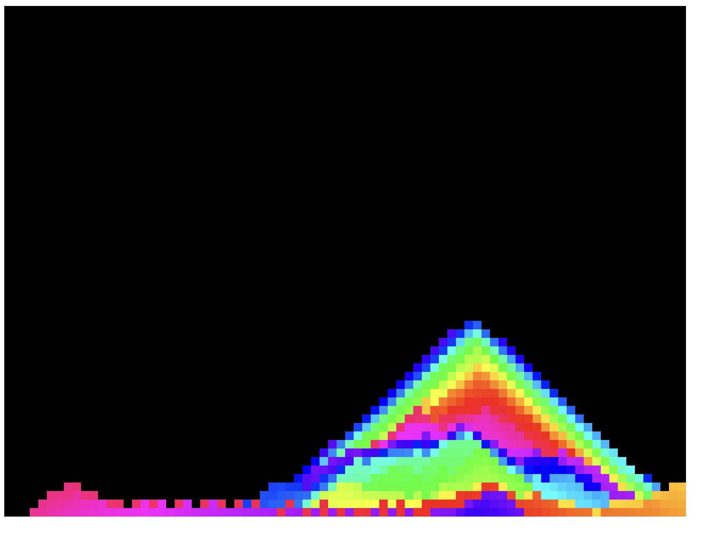
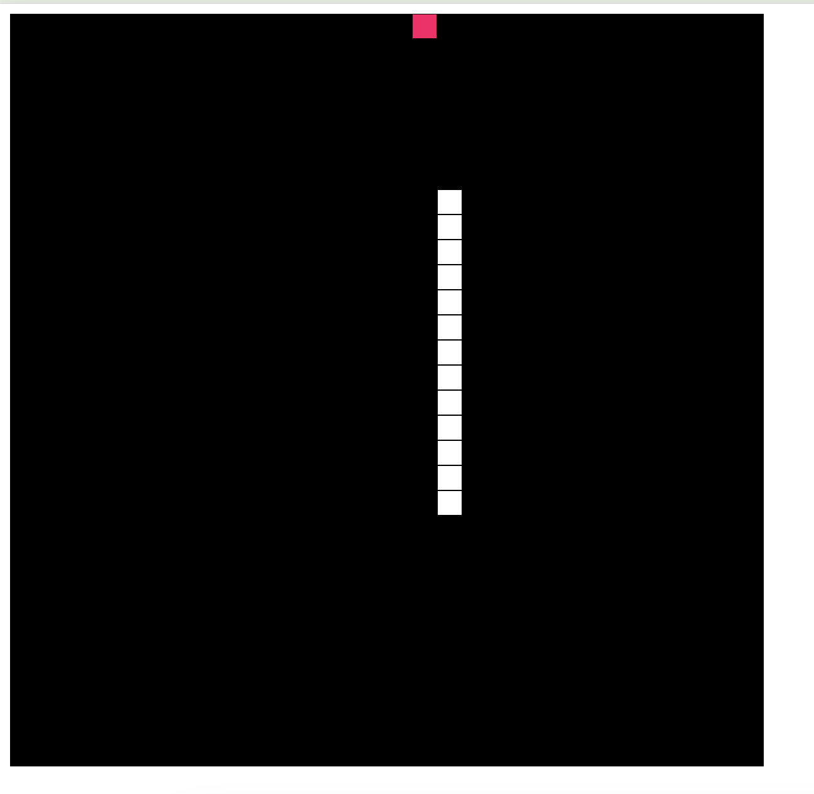

# Juegos Y Graficos en JavaScript
Listado de juegos y graficos en javaScript 

 
## Los programas estan hechos con JavaScript
Las funciones son simples y pueden ser modificadas facilmente
 

# Caida de arena

sistema que simula la caida de arena de varios colores

  

# Juego SNAKE

típico juego SNAKE 

## Puedes visitar mis perfiles siempre estoy compartiendo INFO

* [Mi pagina WEB] (https://tutosingenieria1.blogspot.com/)
* [Mi canal de youtube] (https://www.youtube.com/c/TutosIngenieria)
* [Mi linkedin] (https://www.linkedin.com/in/debbiearredondo/)
* [Mi Instagram] (https://www.instagram.com/tutosingenieria)

